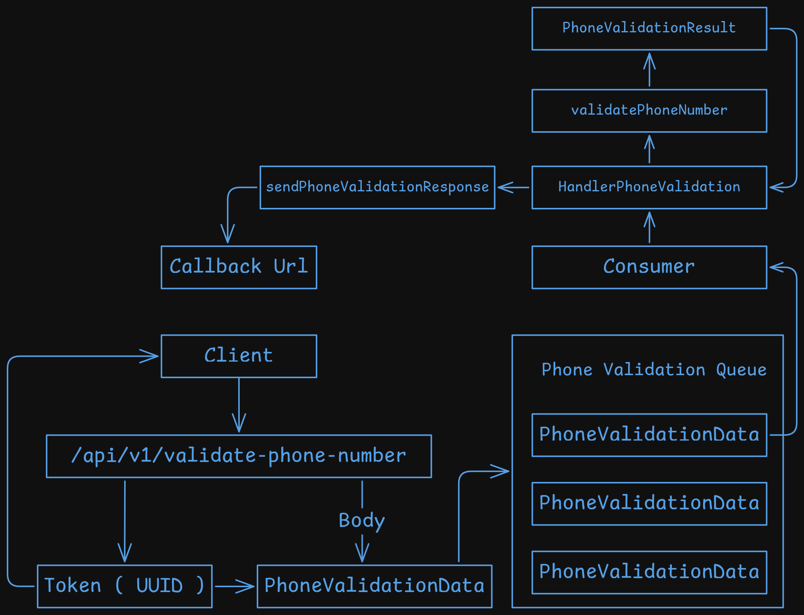

# **Go validate phone API**  

This project implements an API written in Go with the goal of studying the language.


#### Disclaimers

A validated phone number does not necessarily mean that it belongs to a specific person. Instead, it refers to a number that has been analyzed, resulting in one of two possible outcomes:

    UNMATCHED – The number does not belong to the person.
    MATCHED – The number belongs to the person.

When a number receives one of these responses, it is considered validated.

## API Reference

#### Validate if a phone number belongs to a person's identity ID. 

```http
  POST /api/v1/validate-phone-number
```

| Parameter | Type     | Description                |
| :-------- | :------- | :------------------------- |
| `phone` | `string` | **Required** Phone number |
| `national_identy_number` | `string` | **Required** National identy number e.g: for Brazil is CPF.|
| `callback_url` | `string` | **Required** The webhook that will receive the validation response.|

Schema endpoint



#### Add a validated phone

```http
  POST /api/v1/new-validated-phone-number
```

| Parameter | Type     | Description                       |
| :-------- | :------- | :-------------------------------- |
| `phone` | `string` | **Required**. Phone number. |
| `national_identy_number` | `string` | **Required**. National identy number.|
| `status` | `string` | **Required**. MATCHED or UNMATCHED.|


## Roadmap

- Add tests
- Add authetication

